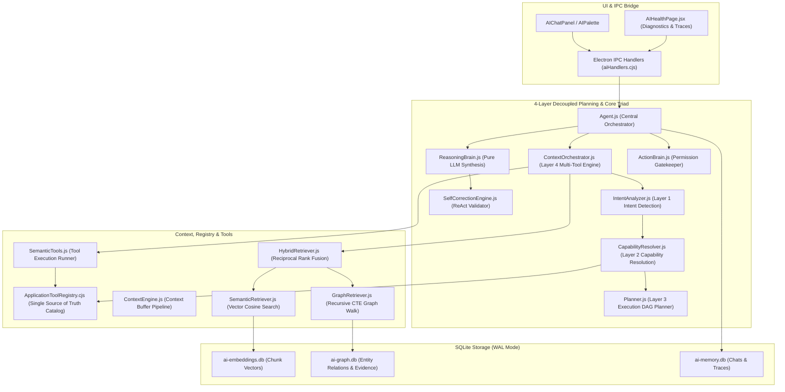

# Notely AI Platform — Comprehensive AI & Agent Subsystem Architecture

This directory contains the codebase for Notely's local-first, modular AI platform. Markdown notes remain the single source of truth, parsed and indexed into offline-first SQLite databases (`ai-embeddings.db`, `ai-graph.db`, `ai-memory.db`).

---

## AI Platform Overview & Design Philosophy

Notely's AI is engineered as an **intelligent knowledge companion** rather than a generic LLM chatbot wrapper.

### Core Guiding Principles:
1. **Human-like & Natural**: Speaks like a knowledgeable pair programmer and workspace teammate. Never exposes internal technical mechanics (`"search_notes"`, `"vector similarity"`, `"knowledge graph nodes"`).
2. **Context-Aware & Grounded**: Proactively retrieves workspace facts before generating answers. All claims are grounded in verified note file links (`[file.md](file:///path)`).
3. **Multi-Tool Planning & Orchestration**: Dynamically executes parallel retrievals, chains tool outputs, and evaluates evidence confidence before answer synthesis.
4. **Strict Note Immutability**: Existing notes are **100% read-only**. AI tools cannot update, edit, move, rename, or delete existing user notes under any circumstances.
5. **Local-First & Provider Agnostic**: Leverages local ONNX embeddings (`BGE-small-en-v1.5`) and background worker processes (`utilityProcess`), while supporting Gemini, Groq, OpenAI, and Local GGUF models.

---

## Complete 3-Brain Subsystem Architecture



---

## Subsystem Component Reference

### 1. 3-Brain Architectural Triad & Orchestrator

| Component | File Path | Architectural Responsibility | Key Safeguards & Capabilities |
|---|---|---|---|
| Component | File Path | Architectural Responsibility | Key Safeguards & Capabilities |
|---|---|---|---|
| **IntentAnalyzer** | [`ai/core/IntentAnalyzer.js`](file:///c:/Users/oksbw/OneDrive/Desktop/Antigravity%20Workspace/Notely/ai/core/IntentAnalyzer.js) | Intent Detection & Goal Deconstruction | Deconstructs queries into Goal, Domain, Information Needs, and Sub-intents dynamically from `ApplicationToolRegistry` metadata. |
| **CapabilityResolver** | [`ai/core/CapabilityResolver.js`](file:///c:/Users/oksbw/OneDrive/Desktop/Antigravity%20Workspace/Notely/ai/core/CapabilityResolver.js) | Capability Resolution & Endpoint Binding | Maps Information Needs to Abstract Capabilities (`notes:search`, `tasks:extract`, `graph:traverse`, `web:search`). Binds tool endpoints dynamically. |
| **Planner** | [`ai/core/Planner.js`](file:///c:/Users/oksbw/OneDrive/Desktop/Antigravity%20Workspace/Notely/ai/core/Planner.js) | Execution Plan Generation (DAG) | Generates structured capability plans (`ExecutionPlan`). Uses Vercel AI SDK `generateObject` when online; local capability DAG when offline. |
| **ContextOrchestrator** | [`ai/core/ContextOrchestrator.js`](file:///c:/Users/oksbw/OneDrive/Desktop/Antigravity%20Workspace/Notely/ai/core/ContextOrchestrator.js) | Multi-Tool Planning & Context Aggregation | Coordinates full 4-layer lifecycle (`IntentAnalyzer` -> `CapabilityResolver` -> `Planner` -> Tool Execution Engine -> Evidence Aggregation). |
| **ApplicationToolRegistry**| [`electron/tools/ApplicationToolRegistry.cjs`](file:///c:/Users/oksbw/OneDrive/Desktop/Antigravity%20Workspace/Notely/electron/tools/ApplicationToolRegistry.cjs) | Single Source of Truth Tool Catalog | Central registry for tool schemas, capabilities, permissions, and Vercel AI SDK / MCP output formats. Enforces note immutability (`notes.move` removed). |

### 2. Planning & Tool Ecosystem

| Component | File Path | Responsibility | Capabilities |
|---|---|---|---|
| **SemanticTools** | [`ai/tools/SemanticTools.js`](file:///c:/Users/oksbw/OneDrive/Desktop/Antigravity%20Workspace/Notely/ai/tools/SemanticTools.js) | High-Level Tool Execution Runner | Executes tools dynamically via `applicationToolRegistry.executeTool(toolName, args)` with local hybrid retriever fallbacks. |

### 3. Prompting, Persona & Grounding System

| Component | File Path | Responsibility | Features |
|---|---|---|---|
| **PromptLibrary** | [`ai/core/PromptLibrary.js`](file:///c:/Users/oksbw/OneDrive/Desktop/Antigravity%20Workspace/Notely/ai/core/PromptLibrary.js) | Modular System Prompts | Assembles base policies, dynamic domain context inference, active persona instructions, and workspace context. |
| **GroundingEngine** | [`ai/core/GroundingEngine.js`](file:///c:/Users/oksbw/OneDrive/Desktop/Antigravity%20Workspace/Notely/ai/core/GroundingEngine.js) | Citation Link Validator | Audits file link citations (`[label](file:///path)`) against disk and strips broken links before response output. |
| **SelfCorrectionEngine**| [`ai/core/SelfCorrectionEngine.js`](file:///c:/Users/oksbw/OneDrive/Desktop/Antigravity%20Workspace/Notely/ai/core/SelfCorrectionEngine.js) | ReAct Response Validation Pass | Intercepts draft responses, strips leaked technical tool narration jargon, and validates grounding. |

---

## 4-Layer Decoupled Planning & Context Orchestration

`ContextOrchestrator.js` coordinates a 4-layer decoupled planning architecture:

1. **Layer 1 (Intent Detection)**: `IntentAnalyzer.js` deconstructs query into an `IntentManifest` (Goal, Domain, Information Needs, Sub-intents) dynamically from tool catalog metadata.
2. **Layer 2 (Capability Resolution)**: `CapabilityResolver.js` maps Information Needs to Abstract Semantic Capabilities (`notes:search`, `tasks:extract`, `graph:traverse`, `web:search`) and binds registered tool endpoints dynamically.
3. **Layer 3 (Execution Planning)**: `Planner.js` constructs an ordered execution DAG plan (`ExecutionPlan`). Uses active LLM provider when online; local dynamic capability DAG when offline.
4. **Layer 4 (Tool Orchestration)**: `ContextOrchestrator.js` executes capability steps in parallel/chained steps, evaluates confidence ($0.0 - 1.0$), and consolidates evidence payload for `ReasoningBrain.js`.

---

## Verification & Test Suite Execution

All AI subsystem components are covered by Vitest test suites under `tests/ai/`:

```bash
node node_modules/vitest/vitest.mjs run tests/ai
```

### Test Suite Map (27 Test Files / 72 Tests Passing 100%):
- `tests/ai/orchestrator.spec.js`: Multi-tool planning, parallel retrieval & evidence aggregation tests.
- `tests/ai/brainTriad.spec.js`: 3-Brain isolation & note immutability tests.
- `tests/ai/planner.spec.js`: Intent classification & semantic tools tests.
- `tests/ai/grounding.spec.js`: Citation link verification & prompt composition tests.
- `tests/ai/selfCorrection.spec.js`: ReAct validation pass & zero-jargon gate tests.
- `tests/ai/harness.spec.js`: Evaluation harness metrics tests.
- `tests/ai/knowledgeGraph.spec.js`: Recursive CTE graph traversal & UTC date matching tests.
