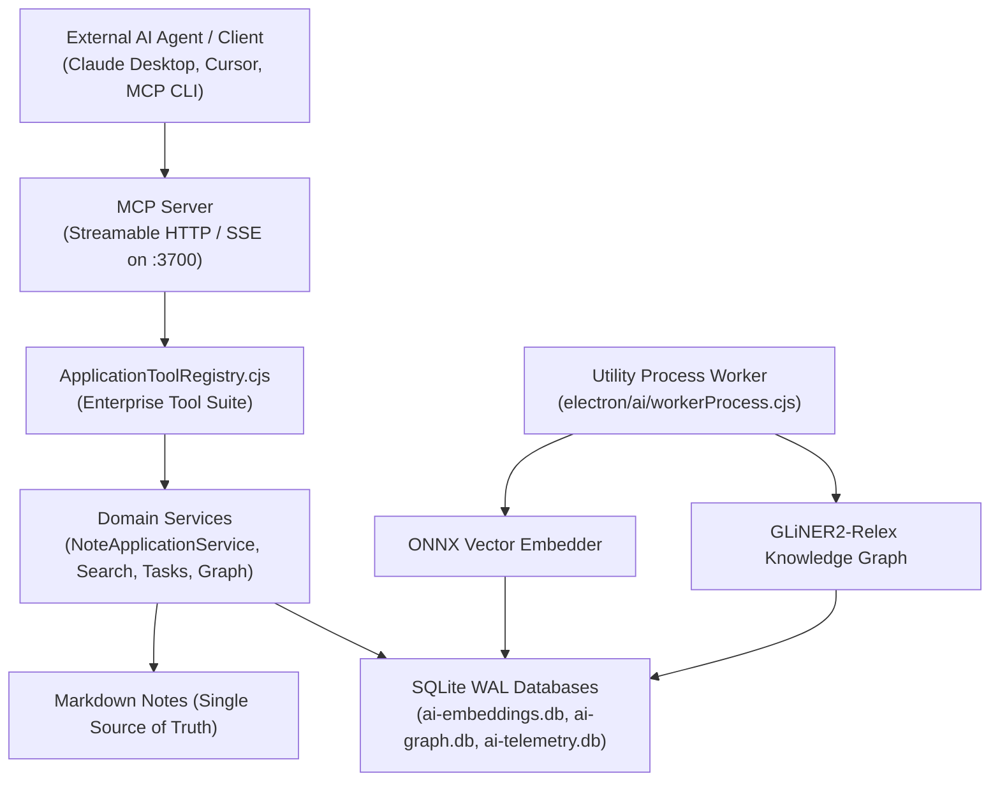

# Notely AI Capability & Indexing Subsystem Reference

This directory contains the codebase for Notely's local-first capability and indexing subsystem. Rather than operating as an interactive conversational AI assistant, Notely behaves as an **MCP Capability Provider** for external AI agents (Claude Desktop, Cursor, local tools) via the **Model Context Protocol (MCP)**.

Internal AI models and background workers are retained strictly for deterministic knowledge extraction, semantic indexing, and search capabilities. Markdown notes remain the single source of truth, parsed and indexed into offline-first SQLite databases (`ai-embeddings.db`, `ai-graph.db`, `ai-telemetry.db`).

---

## Active AI Capability Domains

| Domain Directory | Entry Point Facade | Architectural Responsibilities |
|---|---|---|
| **`ai/embeddings/`** | `index.js` | `EmbeddingDB`, `EmbeddingService`, ONNX BGE-small-en-v1.5 transformer embedder |
| **`ai/graph/`** | `index.js` | `GraphDB`, `GraphService`, `GraphBuilder`, GLiNER2-Relex neural entity/relation extraction |
| **`ai/queue/`** | `index.js` | Background utility process workers (`IndexWorker`, `GraphWorker`) for non-blocking note indexing |
| **`ai/tools/`** | `index.js` | `ToolRegistry`, `SemanticTools`, `DocumentReader`, internal note querying primitives |
| **`ai/context/`** | `index.js` | `ContextManager`, `SemanticRetriever`, `GraphRetriever`, `HybridRetriever` |
| **`ai/memory/`** | `index.js` | `MemoryDB`, `InteractionLog`, `MemoryOptimizer`, `PatternAnalyzer` |
| **`ai/telemetry/`**| `index.js` | `TelemetryDB`, `AIEventBus`, structured logging of MCP tool calls and durations |
| **`ai/logs/`**     | `index.js` | `LogDB` persistent log storage for indexing operations |
| **`ai/providers/`**| `index.js` | `LLMRegistry`, `HuggingFaceEmbeddingProvider`, `LocalONNXProvider`, `GeminiProvider` |
| **`ai/diagnostics/`**| `index.js`| `AIHealth` metrics aggregator for MCP `/health` and status screens |
| **`ai/formatter/`**| `index.js` | Markdown response formatting and task summary formatters |

---

## High-Level Architecture Flow

```mermaid
graph TD
  ExternalClient["External AI Agent / Client\n(Claude Desktop, Cursor, MCP CLI)"] --> MCPServer["MCP Server\n(Streamable HTTP / SSE on :3700)"]
  MCPServer --> ToolRegistry["ApplicationToolRegistry.cjs\n(Enterprise Tool Suite)"]
  ToolRegistry --> Capabilities["Domain Services\n(NoteApplicationService, Search, Tasks, Graph)"]
  Capabilities --> Notes["Markdown Notes (Single Source of Truth)"]
  Capabilities --> DBs["SQLite WAL Databases\n(ai-embeddings.db, ai-graph.db, ai-telemetry.db)"]
  BackgroundWorker["Utility Process Worker\n(electron/ai/workerProcess.cjs)"] --> Embeddings["ONNX Vector Embedder"]
  BackgroundWorker --> GraphEngine["GLiNER2-Relex Knowledge Graph"]
  Embeddings --> DBs
  GraphEngine --> DBs
```

---

## MCP Server & Endpoints

- **Health**: `GET http://127.0.0.1:3700/health`
- **Tool Listing**: `GET http://127.0.0.1:3700/tools`
- **Prompts**: `GET http://127.0.0.1:3700/prompts`
- **Streamable HTTP Session**: `POST http://127.0.0.1:3700/mcp`
- **Server-Sent Events (SSE)**: `GET http://127.0.0.1:3700/sse`
