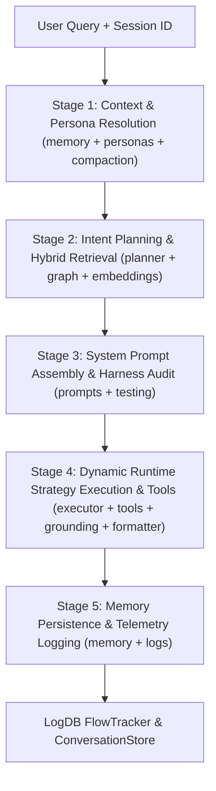

# Notely AI Platform — Master Architecture & Subsystem Reference

This directory contains the codebase for Notely's local-first, 13-domain modular AI platform. Markdown notes remain the single source of truth, parsed and indexed into offline-first SQLite databases (`ai-embeddings.db`, `ai-graph.db`, `ai-memory.db`).

---

## AI Platform Overview & Core Architecture

Notely's AI is engineered as a **modular, local-first intelligent knowledge companion**. 

All 13 sub-domains are decoupled into dedicated directories with a mandatory single entry point facade (`index.js`). All query execution is coordinated by the master orchestrator **`AIFlow.js`** through a 5-stage pipeline with structured telemetry logging to `LogDB` (`FlowTracker`) and zero-latency **Context Compaction** (`ai/compaction/`).

---

## Complete 14-Domain Module Directory Map

| Domain Directory | Entry Point Facade | Architectural Responsibilities |
|---|---|---|
| **`ai/compaction/`** | `index.js` | **`CompactionEngine` (0ms NLP intent/outcome extractor & 2-tier sliding window compactor)** |
| **`ai/planner/`** | `index.js` | `Planner`, `ContextOrchestrator`, `IntentAnalyzer`, `CapabilityResolver`, multi-tool RAG |
| **`ai/brains/`** | `index.js` | `WorkspaceBrain`, `ReasoningBrain`, `ActionBrain` (3-Brain Triad reasoning engine) |
| **`ai/personas/`** | `index.js` | `PersonaManager`, `PersonaStandard`, persona DB validation & prompt overlays |
| **`ai/prompts/`** | `index.js` | `PromptPipeline`, `PromptLoader`, `TemplateEngine`, `PromptLibrary` (system prompt assembly) |
| **`ai/context/`** | `index.js` | `ContextEngine`, `ContextManager`, `SemanticRetriever`, `GraphRetriever`, `HybridRetriever` |
| **`ai/graph/`** | `index.js` | `GraphDB`, `GraphService`, `GraphBuilder`, `MarkdownASTParser`, GLiNER/GLiREL neural models |
| **`ai/embeddings/`** | `index.js` | `EmbeddingDB`, `EmbeddingService`, ONNX Transformer embedder |
| **`ai/memory/`** | `index.js` | `ConversationStore`, `MemoryDB`, `PersonaDB`, `InteractionLog` |
| **`ai/executor/`** | `index.js` | `QueryExecutor`, `SelfCorrectionEngine` (Runtime Dynamic Strategies) |
| **`ai/tools/`** | `index.js` | `ToolRegistry`, `SemanticTools`, `DocumentReader`, Application Tool Registry |
| **`ai/grounding/`** | `index.js` | `GroundingEngine` (citation link validator, line links, note title claim linter) |
| **`ai/formatter/`** | `index.js` | Response Formatter (markdown clean-up, tool output formatting) |
| **`ai/testing/`** | `index.js` | `PromptTester` (Prompt Safety Harness, policy linter, test audit runner) |

---

## Master Flow Orchestrator Pipeline (`ai/core/AIFlow.js`)


```mermaid
graph TD
  UserQuery["User Query + Session ID"] --> Stage1["Stage 1: Context & Persona Resolution (memory + personas + compaction)"]
  Stage1 --> Stage2["Stage 2: Intent Planning & Hybrid Retrieval (planner + graph + embeddings)"]
  Stage2 --> Stage3["Stage 3: System Prompt Assembly & Harness Audit (prompts + testing)"]
  Stage3 --> Stage4["Stage 4: Dynamic Runtime Strategy Execution & Tools (executor + tools + grounding + formatter)"]
  Stage4 --> Stage5["Stage 5: Memory Persistence & Telemetry Logging (memory + logs)"]
  Stage5 --> Telemetry["LogDB FlowTracker & ConversationStore"]
```

### Stage Summary:
1. **Stage 1 (Context & Persona Resolution)**: Resolves conversation state, loads active persona, and applies 0ms context compaction (`ai/compaction/`).
2. **Stage 2 (Intent Planning & Hybrid Retrieval)**: `ContextOrchestrator` runs parallel vector/graph retrieval & confidence scoring.
3. **Stage 3 (System Prompt Assembly & Safety Audit)**: `PromptPipeline` assembles system prompt & runs safety invariant linter.
4. **Stage 4 (Runtime Dynamic Strategy Execution & Tools)**: `QueryExecutor` resolves runtime strategy (Streaming, Multi-step tool loop, Self-correction verification) and runs `GroundingEngine`.
5. **Stage 5 (Memory Persistence & Telemetry Logging)**: Persists turn to `ConversationStore` and logs 5-stage trace payload to `LogDB` (`FlowTracker`).

---

## Context Compaction Algorithm (`ai/compaction/`)

- **2-Tier Sliding Window Algorithm**:
  - **Tier 1 (Verbatim Window)**: Recent 4 messages preserved verbatim for immediate context.
  - **Tier 2 (Executive Memory Summary)**: Older turns programmatically compressed into structured bullet points using 0ms NLP intent & outcome extraction heuristics:
    ```markdown
    [EXECUTIVE MEMORY SUMMARY OF PAST TURNS]
    - Turn 1: User requested "explain auth" -> Referenced notes: Architecture Notes
    - Turn 2: User requested "add telemetry" -> Generated code snippet/action
    ```
- **Benefits**: ~75-80% input token reduction, faster LLM latency, zero text redundancy.

---

## AI Health & Diagnostics UI (`AIHealthPage.jsx`)

- **Messages Tab**: Clean conversation transcript (technical tool call boxes removed).
- **Flow Telemetry Tab**: Interactive 5-stage execution trace view displaying:
  1. Timeline & duration per stage
  2. Persona & active note context
  3. Pre-retrieval trace steps & confidence score
  4. System prompt viewer with Copy & Expand
  5. Tool calls with input arguments & output payloads
  6. Compaction stats (`compactedTurnsCount`, `isCompacted`)
  7. Token consumption & latency breakdown

---

## Verification & Test Suite Execution

All AI subsystem modules are fully covered by unit & integration test suites under `tests/ai/`:

```bash
npm test
```

### Test Suite Summary:
- **59 Test Files Passed (100% Pass Rate)**
- **249 Individual Tests Passed**
- Key Test Specs:
  - `tests/ai/flow.spec.js`: Master `AIFlow` 5-stage orchestration & telemetry tests.
  - `tests/ai/facades.spec.js`: Single entry point facade export integrity for all 13 modules.
  - `tests/ai/compaction.spec.js`: Zero-latency NLP intent extraction & sliding window compaction tests.
