# AI Subsystem & Master Flow Architecture

Notely implements a local-first, offline-ready 13-domain AI architecture designed for privacy, low latency, multi-tool evidence orchestration, zero-latency context compaction, and deterministic grounding. Markdown notes remain the single source of truth, parsed and indexed into offline-first SQLite databases.

---

## 13-Domain Decoupled Module Facade Blueprint

All 13 sub-domains expose a mandatory single entry point facade (`index.js`). All query executions are coordinated by the master orchestrator **`AIFlow.js`** through a 5-stage pipeline with structured telemetry logging to `LogDB` (`FlowTracker`) and zero-latency **Context Compaction** (`ai/compaction/`).

```mermaid
flowchart TD
    subgraph Renderer["Renderer Process (React / Vite)"]
        direction LR
        AICP["AIChatPanel (Sidebar Chat)"] & AIP["AIPalette (Inline AI)"] & AIH["AIHealthPage (Diagnostics & Traces)"] & KGV["KnowledgeGraph (Visualizer)"]
    end

    subgraph Preload["Preload Bridge (preload.cjs)"]
        CB["window.electronAPI.ai.*"]
    end

    subgraph Handlers["AI IPC Handlers (aiHandlers.cjs)"]
        TRUST["Trusted Sender Guard"]
        CHAN["55+ ipcMain.handle channels"]
    end

    subgraph AIService["AI Service Coordinator (AIService.js)"]
        SW["Master Enable / Disable Switch"]
        AIFLOW["AIFlow.js (Master 5-Stage Orchestrator)"]
    end

    subgraph Domains ["13 Decoupled Domain Modules (index.js Facades)"]
        COMP["compaction"]
        PLAN["planner"]
        PERS["personas"]
        PROM["prompts"]
        CTX["context"]
        GRAPH["graph"]
        EMB["embeddings"]
        MEM["memory"]
        EXEC["executor"]
        TOOL["tools"]
        GND["grounding"]
        FMT["formatter"]
        TEST["testing"]
    end

    subgraph Storage ["SQLite Storage — WAL Mode"]
        direction LR
        EMBDB[("ai-embeddings.db")] & GRDB[("ai-graph.db")] & MEMDB[("memory.db / personas.db")]
    end

    Renderer -->|"IPC · contextBridge"| Preload
    Preload -->|"ipcMain.handle"| Handlers
    Handlers --> AIService
    AIService --> AIFLOW
    AIFLOW --> Domains
    Domains --> Storage
```



---

## 1. Master Flow Orchestrator (`AIFlow.js`) & 5-Stage Execution Pipeline

Every query executes through `AIFlow.js`:

1. **Stage 1 (Context & Persona Resolution)**: Resolves conversation state, loads active persona, and applies 0ms context compaction (`ai/compaction/`).
2. **Stage 2 (Intent Planning & Hybrid Retrieval)**: `ContextOrchestrator` runs parallel vector/graph retrieval & confidence scoring.
3. **Stage 3 (System Prompt Assembly & Safety Audit)**: `PromptPipeline` assembles system prompt & runs safety invariant linter.
4. **Stage 4 (Runtime Dynamic Strategy Execution & Tools)**: `QueryExecutor` resolves runtime strategy (Streaming, Multi-step tool loop, Self-correction verification) and runs `GroundingEngine`.
5. **Stage 5 (Memory Persistence & Telemetry Logging)**: Persists turn to `ConversationStore` and logs 5-stage trace payload to `LogDB` (`FlowTracker`).

---

## 2. Zero-Latency Context Compaction Engine (`ai/compaction/`)

- **2-Tier Sliding Window Algorithm**:
  - **Tier 1 (Verbatim Window)**: Recent 4 messages preserved verbatim for immediate context.
  - **Tier 2 (Executive Memory Summary)**: Older turns programmatically compressed into structured bullet points using 0ms NLP intent & outcome extraction heuristics:
    ```markdown
    [EXECUTIVE MEMORY SUMMARY OF PAST TURNS]
    - Turn 1: User requested "explain auth" -> Referenced notes: Architecture Notes
    - Turn 2: User requested "add telemetry" -> Generated code snippet/action
    ```
- **Benefits**: ~75-80% input token reduction, faster LLM latency, zero text redundancy.

---

## 3. UI Diagnostics & Telemetry (`AIHealthPage.jsx`)

- **Messages Tab**: Clean conversation transcript (technical tool call boxes removed).
- **Flow Telemetry Tab**: Interactive 5-stage execution trace view displaying:
  1. Timeline & duration per stage
  2. Persona & active note context
  3. Pre-retrieval trace steps & confidence score
  4. System prompt viewer with Copy & Expand
  5. Tool calls with input arguments & output payloads
  6. Compaction stats (`compactedTurnsCount`, `isCompacted`)
  7. Token consumption & latency breakdown

---

## 4. Test Suite Verification

Covered by Vitest test suites under `tests/ai/` (**59 test files / 249 tests passing 100%**):
* `tests/ai/flow.spec.js`: Master `AIFlow` 5-stage orchestration & telemetry tests.
* `tests/ai/facades.spec.js`: Single entry point facade export integrity for all 13 modules.
* `tests/ai/compaction.spec.js`: Zero-latency NLP intent extraction & sliding window compaction tests.
* `tests/ai/grounding.spec.js`: Citation link verification & prompt composition tests.
* `tests/ai/knowledgeGraph.spec.js`: Knowledge Graph recursive CTE & UTC date matching tests.
