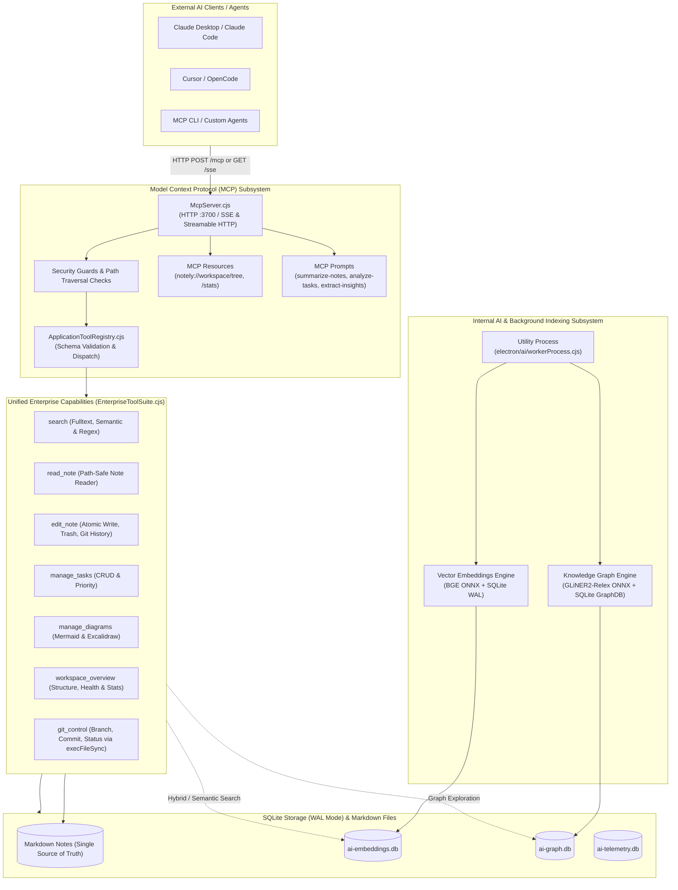

# AI Subsystem & MCP Capability Architecture

Notely operates as a **local-first capability provider** via the **Model Context Protocol (MCP)**. Native conversational AI and chat loops have been decommissioned in favor of exposing application capabilities directly to external AI agents and clients (e.g. Claude Desktop, OpenCode, Cursor, local agent runtimes).

Local AI models and background workers are retained solely for deterministic knowledge extraction and semantic indexing:
- **Vector Embeddings**: BGE-small-en ONNX model generating embeddings for hybrid search.
- **Knowledge Graph**: GLiNER2-Relex ONNX model extracting entities and semantic relationships between notes.
- **MCP Server & Tool Registry**: Exposing unified, enterprise-grade capabilities to external agents over SSE and Streamable HTTP.

---

## High-Level Architecture Blueprint

---

## 1. Model Context Protocol (MCP) Subsystem

External agents connect to Notely via standard MCP over:
1. **Streamable HTTP**: `POST /mcp` for direct JSON-RPC request-response cycles.
2. **Server-Sent Events (SSE)**: `GET /sse` for persistent event streaming.
3. **Health Check**: `GET /health` providing server status, connected sessions, tools count, and resources count.

### Unified Capabilities (7 Tools)
Rather than fragmenting operations into dozens of micro-endpoints, Notely provides 7 canonical enterprise tools:

| Tool Name | Scope & Capabilities | Security / Safeguards |
| :--- | :--- | :--- |
| `search` | Fulltext keyword, semantic vector similarity, and regex search across notes | ReDoS-safe regex validation, max quantifier limits |
| `read_note` | Read markdown note contents, frontmatter, and backlink references | Path traversal rejection (`..` escaping prohibited) |
| `edit_note` | Create, update, append, prepend, delete, and fetch Git file history | Atomic write via temp file, OS trash bin integration, write-protection enforcement |
| `manage_tasks` | List, filter, toggle, create, and prioritize tasks across workspace | Schema-enforced operations, date validation |
| `manage_diagrams`| Create, render, and update Mermaid and Excalidraw diagrams | Strict syntax validation |
| `workspace_overview` | Summary stats, note directory tree, orphans, tags, and health audits | Default operation fallbacks, scoped path traversal check |
| `git_control` | Workspace status, diff, log, commit, branch checkout | `execFileSync` parameter isolation (immune to shell injection) |

---

## 2. Standard MCP Resources

Notely exposes workspace state as read-only MCP resources:
- `notely://workspace/tree`: Returns recursive folder and file structure with file size and modification timestamps.
- `notely://workspace/stats`: Returns aggregated workspace statistics (note count, task counts, word count, disk usage).

External agents can read these resources directly without calling tools.

---

## 3. Background Workers & Local ONNX Indexing

Notely preserves local ONNX inference infrastructure strictly for non-conversational indexing:
- **Embeddings Worker**: Runs in a separate Node.js utility process to avoid blocking the main UI thread. Chunks markdown documents, computes 384-dimensional dense vectors using BGE-small-en ONNX, and persists vectors to SQLite WAL tables.
- **Graph Worker**: Runs local GLiNER2-Relex ONNX model to extract named entities (people, concepts, technologies, projects) and typed relationships directly from markdown notes.

---

## 4. Telemetry & Audit Logs

All MCP tool invocations, execution durations, errors, and caller identities are persisted to `.notes-app/ai-telemetry.db`:
- Managed via `McpLifecycle.cjs` with pooled database instance reuse per workspace.
- Exposed via `/health` metrics and internal developer logs.
- Automatic cleanup on application shutdown.
