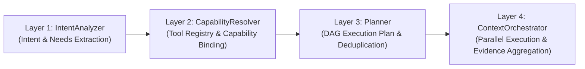

# AI Subsystem & Master Flow Architecture

Notely implements a local-first, offline-ready 13-domain AI architecture designed for privacy, low latency, multi-tool evidence orchestration, zero-latency context compaction, and deterministic grounding. Markdown notes remain the single source of truth, parsed and indexed into offline-first SQLite databases.

---

## 13-Domain Decoupled Module Facade Blueprint

All 13 sub-domains expose a mandatory single entry point facade (`index.js`). No external module or Electron handler is permitted to import private internal files of another module. All query executions are coordinated by the master orchestrator **`AIFlow.js`** through a 5-stage pipeline with structured telemetry logging to `LogDB` (`FlowTracker`) and zero-latency **Context Compaction** (`ai/compaction/`).

```mermaid
flowchart TD
    subgraph Renderer["Renderer Process (React / Vite)"]
        direction LR
        AICP["AIChatPanel (Sidebar Chat)"] & AIP["AIPalette (Inline AI)"] & AIH["AIHealthPage (Diagnostics & Traces)"] & KGV["KnowledgeGraph (Visualizer)"]
    end

    subgraph Preload["Preload Bridge (preload.cjs)"]
        CB["window.notesApi.ai* (45+ IPC methods)"]
    end

    subgraph Handlers["AI IPC Handlers (aiHandlers.cjs)"]
        TRUST["Trusted Sender Guard"]
        CHAN["IPC_EVENTS Protocol Constants (ai/utils/ipcProtocol.js)"]
    end

    subgraph AIService["AI Service Coordinator (AIService.js)"]
        SW["Master Enable / Disable Switch"]
        AIFLOW["AIFlow.js (Master 5-Stage Orchestrator)"]
    end

    subgraph Domains ["13 Decoupled Domain Modules (index.js Facades)"]
        COMP["compaction (CompactionEngine)"]
        PLAN["planner (IntentAnalyzer, CapabilityResolver, Planner)"]
        PERS["personas (PersonaDB, PersonaStore)"]
        PROM["prompts (PromptPipeline, PromptLoader)"]
        CTX["context (ContextEngine, HybridRetriever)"]
        GRAPH["graph (GraphDB, GraphService, EvidenceStore)"]
        EMB["embeddings (EmbeddingDB, ONNXEmbedder)"]
        MEM["memory (MemoryDB, ConversationStore)"]
        EXEC["executor (QueryExecutor, SelfCorrectionEngine)"]
        TOOL["tools (ToolRegistry, getRegisteredTools)"]
        GND["grounding (GroundingEngine)"]
        FMT["formatter (TaskSummaryFormatter)"]
        TEST["testing (PipelineRegression)"]
    end

    subgraph BackgroundProcess ["Utility Process (electron/ai/workerProcess.cjs)"]
        INDEXWRK["IndexWorker (Embeddings)"] & GRAPHWRK["GraphWorker (Knowledge Graph)"]
    end

    subgraph Storage ["SQLite Storage — WAL Mode"]
        direction LR
        EMBDB[("ai-embeddings.db")] & GRDB[("ai-graph.db")] & MEMDB[("ai-memory.db / personas.db")] & TELDB[("ai-telemetry.db")] & LOGDB[("ai-logs.db")]
    end

    Renderer -->|"IPC · contextBridge"| Preload
    Preload -->|"ipcMain.handle / IPC_EVENTS"| Handlers
    Handlers --> AIService
    AIService --> AIFLOW
    AIFLOW --> Domains
    Domains --> Storage
    BackgroundProcess -->|"Consumes Facades"| Domains
```



---

## 1. Master Flow Orchestrator (`AIFlow.js`) & 5-Stage Execution Pipeline

Every query executes through `AIFlow.js`:

1. **Stage 1 (Context & Persona Resolution)**: Resolves conversation state, loads active persona, and applies 0ms context compaction (`ai/compaction/`).
2. **Stage 2 (Intent Planning & Hybrid Retrieval)**: `ContextOrchestrator` executes the 4-layer planning architecture, running tool capability discovery, parallel retrieval, relevance filtering (`score >= 0.25`), and logging `plannerDecision` and `retrievalQuality` metrics.
3. **Stage 3 (System Prompt Assembly & Safety Audit)**: `PromptPipeline` assembles system prompt using pre-compiled static policy caching and runs safety invariant audit.
4. **Stage 4 (Runtime Dynamic Strategy Execution & Tools)**: `QueryExecutor` resolves runtime strategy (multi-step tool loop, LLM provider fallback sequence) and runs `GroundingEngine`.
5. **Stage 5 (Memory Persistence & Telemetry Logging)**: Persists turn to `ConversationStore` and logs full 5-stage trace payload to `LogDB` (`FlowTracker`).

---

## 2. 4-Layer Decoupled Planning Architecture

The planning system maps user queries into dynamic tool execution DAGs without hardcoded query strings or function signatures.



### Layer 1: Intent Analysis (`IntentAnalyzer.js`)
- Dynamically matches query terms against registered tool metadata in `ApplicationToolRegistry`.
- Classifies intents such as `workspace_task_summary` (confidence >0.80), `explore_knowledge_graph`, `reconstruct_project_timeline`, and `fetch_external_web_data`.
- Enforces capability priority: Task Intent > Workspace Search > Graph Exploration.

### Layer 2: Capability Resolution (`CapabilityResolver.js`)
- Resolves abstract information needs (`action_items`, `tasks`, `entity_relationships`, `recent_changes`) into bound tool capabilities (`tasks:extract`, `notes:search`, `graph:traverse`).

### Layer 3: Plan DAG Generation (`Planner.js`)
- Constructs deduplicated execution plan steps by `toolName`.
- Restricts graph search (`explore_topic_graph`) for task queries unless relation/graph traversal is explicitly requested in the query.
- Emits structured `plannerDecision` telemetry:
  ```json
  {
    "intent": "workspace_task_summary",
    "confidence": 0.92,
    "selectedStrategy": "task_pipeline",
    "rejectedStrategies": ["graph_search"]
  }
  ```

### Layer 4: Multi-Tool Context Orchestration (`ContextOrchestrator.js`)
- **Retrieval Priority Ordering**:
  1. Primary Task Database / Tool (`get_tasks`)
  2. Markdown Task Syntax Parser (`- [ ]`, `TODO`, `FIXME`, status fields)
  3. Recent Workspace Activity (`workspace.recent_activity`)
  4. Vector Semantic Search (`search_notes`)
  5. Graph Traversal (`explore_topic_graph`, only when requested)
- **Empty Retrieval Handling**: If `get_tasks()` returns empty, executes markdown task syntax parsing and recent workspace activity. If still empty, returns `"No tasks found in your workspace."` without fabricating unrelated notes or running graph search.
- **Relevance Filtering**: Rejects evidence items with similarity score `< 0.25`.
- **Evidence Quality Telemetry**: Captures `retrievalQuality` items:
  ```json
  {
    "sourceType": "notes.extract_tasks",
    "similarityScore": 0.02,
    "accepted": false,
    "rejectedReason": "below relevance threshold"
  }
  ```

---

## 3. Static Prompt Assembly Caching (`PromptPipeline.js`)

To optimize prompt construction latency and prevent redundant byte joins, `PromptPipeline` splits system prompts into static and dynamic blocks:

- **Static Block (Pre-compiled & Cached)**: Core foundational policies (`base-system`, `behavior-policy`, `safety-policy`, `formatting-policy`, `permission-policy`, `grounding-policy`).
- **Dynamic Block**: Runtime context (`persona`, `workspaceContext`, `retrievedEvidence`, `uiContext`).

---

## 4. Multi-Tier LLM Provider Fallback (`QueryExecutor.js`)

When an active LLM provider fails (e.g. rate limit 429, network timeout, API error):

1. Attempts execution via secondary configured LLM provider in `LLMRegistry`.
2. Falls back to local ONNX model (`local-onnx`).
3. Returns structured error payload if all providers fail.
4. Emits `llmFallbackTriggered: true` in execution telemetry.

---

## 5. Zero-Latency Context Compaction Engine (`ai/compaction/`)

- **2-Tier Sliding Window Algorithm**:
  - **Tier 1 (Verbatim Window)**: Recent 4 messages preserved verbatim for immediate context.
  - **Tier 2 (Executive Memory Summary)**: Older turns programmatically compressed into structured bullet points using 0ms NLP intent & outcome extraction heuristics:
    ```markdown
    [EXECUTIVE MEMORY SUMMARY OF PAST TURNS]
    - Turn 1: User requested "explain auth" -> Referenced notes: Architecture Notes
    - Turn 2: User requested "add telemetry" -> Generated code snippet/action
    ```
- **Benefits**: ~75-80% input token reduction, faster LLM latency, zero text redundancy.

---

## 6. UI Diagnostics & Flow Telemetry (`AIHealthPage.jsx`)

- **Messages Tab**: Clean conversation transcript (technical tool call boxes removed).
- **Flow Telemetry Tab**: Interactive 5-stage execution trace view displaying:
  1. Timeline & duration per stage
  2. Persona & active note context
  3. Pre-retrieval trace steps, confidence score & `plannerDecision`
  4. System prompt viewer with Copy & Expand
  5. `retrievalQuality` list with similarity scores and acceptance/rejection reasons
  6. Tool calls with input arguments & output payloads
  7. Compaction stats (`compactedTurnsCount`, `isCompacted`)
  8. Token consumption, latency breakdown & `llmFallbackTriggered` flag

---

## 7. Automated Test Verification

Covered by Vitest test suites under `tests/ai/` (**62 test files / 270 tests passing 100%**):
* `tests/ai/pipelineRegression.spec.js`: Task intent routing, graph restriction, task parser fallback, relevance filtering (<0.25 rejection), and concept graph retrieval regression tests.
* `tests/ai/flow.spec.js`: Master `AIFlow` 5-stage orchestration & telemetry tests.
* `tests/ai/decoupledPlanning.spec.js`: 4-Layer Decoupled Planning Architecture tests.
* `tests/ai/compaction.spec.js`: Zero-latency NLP intent extraction & sliding window compaction tests.
* `tests/ai/grounding.spec.js`: Citation link verification & prompt composition tests.
