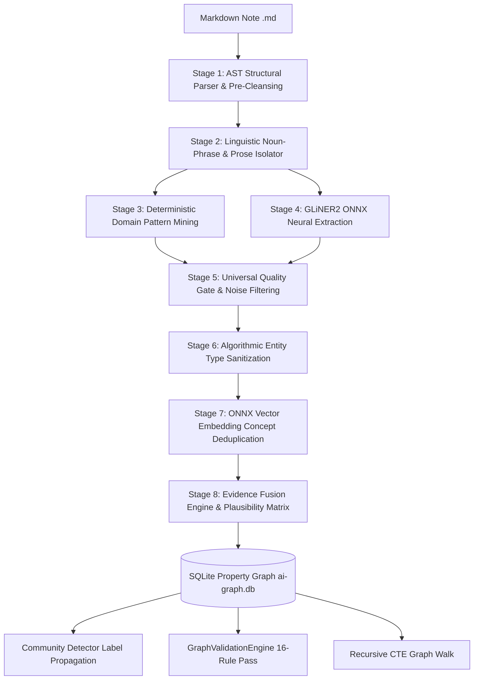
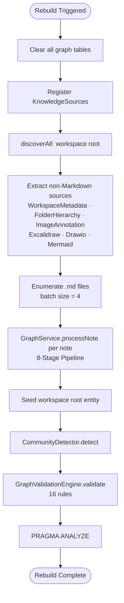
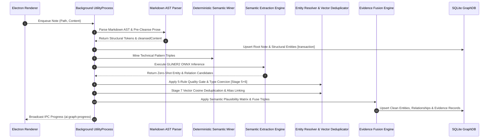
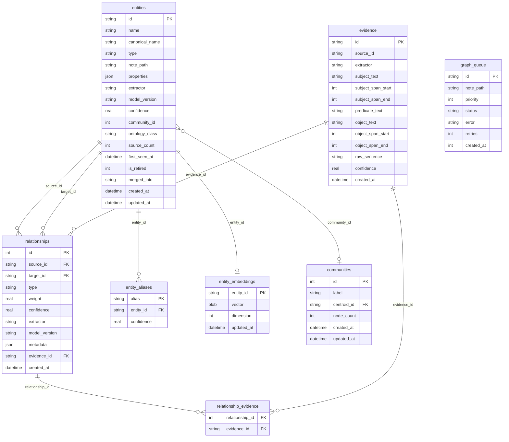

# Knowledge Graph Generation Engine

Notely features an offline, local-first, AI-powered **8-Stage Knowledge Graph Generation Engine**. It operates without any cloud dependencies, transforming raw Markdown notes, image annotations, and workspace metadata into an interconnected Property Graph using local FP16 ONNX neural models, SQLite vector storage, deterministic domain pattern mining, and hybrid GraphRAG retrieval.

---

## Architecture Overview

The system uses an 8-stage pipeline separating document structure parsing from model-agnostic neural semantic extraction, vector embedding deduplication, and evidence fusion.

---

## The 8 Pipeline Stages

### Stage 1: AST Structural Parser & Pre-Cleansing
- **Component:** `MarkdownASTParser.js`
- **Role:** Extracts structural AST entities (`Note`, `Section`, `Tag`, `Media`, `CodeBlock`, `Task`, `Formula`, `ExternalURL`, `Document`). Strips HTML attributes (`{data-*="..."}`), markdown tables (`| ... |`), image tags, key-value metadata lines, and frontmatter metadata to produce clean natural prose text for neural extraction.

### Stage 2: Linguistic Noun-Phrase & Prose Isolator
- **Component:** `MarkdownASTParser.cleanse()`
- **Role:** Produces `cleansedContent` — stripped natural language prose from which all markdown structure, code syntax, and editor artifacts have been removed. This cleansed text is the sole input to both Stages 3 and 4, preventing structural tokens from corrupting neural inference or pattern matching.

### Stage 3: Deterministic Domain Pattern Mining
- **Component:** `DeterministicSemanticMiner.js`
- **Role:** Mines pattern-based technical domain relationships (`USES`, `DEPENDS_ON`, `GENERATES`, `INTEGRATES_WITH`, `IMPLEMENTS`, `ENABLES`, `WORKS_ON`) directly from prose sentences with $0.88 - 0.92$ baseline confidence. Also performs cross-note plain text mention mining (confidence 0.85) against a live note name index (refreshed every 30s). Results are fused via `EvidenceFusionEngine.fuseTriple()`.

### Stage 4: GLiNER2 ONNX Neural Zero-Shot Extraction
- **Component:** `GLiNER2RelexAdapter.js`
- **Role:** Runs 5-graph ONNX Runtime inference using `gliner2-multi-v1-onnx`. Extracts neural entities and relationships with calibrated sigmoid scoring (`_sigmoid(val + 1.2)`), capped candidate span width (`maxWidth = 4`), and compound disjunctive entity splitting (`"Gemini or Groq"` $\rightarrow$ `"Gemini"`, `"Groq"`).

### Stage 5: Universal Quality Gate & Noise Filtering
- **Component:** `EntityResolver.isValidEntityName()`
- **Role:** Enforces 5 universal rules before any entity can enter the graph:
  1. **Length & Acronym Rule** — $2 \le \text{chars} \le 35$, max 4 words; 2–3 char terms must be whitelisted acronyms (`AI`, `UI`, `DB`, `API`, `SDK`, `CLI`, `SQL`, etc.)
  2. **Grammatical Boundary Rule** — rejects terms starting or ending with prepositions, articles, connectives, or common verb fragments
  3. **Sentence Clause & Aux Verb Rule** — rejects clause fragments containing auxiliary verbs (`will`, `would`, `could`, `should`, `have`, etc.)
  4. **Character Entropy & Phonetic Rule** — must contain at least one vowel; rejects 4+ repeated characters and 5+ consecutive consonant clusters
  5. **Markup & Syntax Artifact Rule** — rejects editor markup, HTML attributes (`data-`), decimal numbers, and table cell patterns

### Stage 6: Algorithmic Entity Type Sanitization & Coercion
- **Component:** `EntityResolver.sanitizeEntityType()`
- **Role:** Applies 7 deterministic type coercion rules. Title-Cased multi-word proper names → `Person`. Strict organization typing requires explicit org suffixes (Corp, Inc, Ltd, Technologies, Labs, etc.). Generic UI terms and structural media terms (`screenshot`, `diagram`, `note`) coerce to `Concept`. No hardcoded entity word lists.

### Stage 7: ONNX Vector Embedding Concept Deduplication & Alias Fusion
- **Component:** `EntityResolver.resolveMentionVector()` + `EntityResolver._cosineSimilarity()` + `entity_embeddings` table
- **Role:** Leverages the existing local ONNX embedder (`bge-small-en-v1.5`) to compute 384-dimensional dense vectors stored in SQLite (`entity_embeddings` table). `EntityResolver` orchestrates the full dedup pipeline: GraphDB canonical name lookup → FTS5 alias search → vector cosine similarity check at $> 0.88$ threshold to automatically merge concept variations (`"SQLite DB"` $\leftrightarrow$ `"SQLite Database"`).

### Stage 8: Evidence Fusion Engine, Plausibility Matrix & Community Detection
- **Component:** `EvidenceFusionEngine.js`, `CommunityDetector.js`, `GraphDB.js`
- **Role:** Merges edge confidence scores using probabilistic union $P(A \cup B) = 1 - (1 - P(A))(1 - P(B))$. Enforces the **Semantic Relationship Plausibility Matrix** (blocks structural node domain actions, restricts `COMMUNICATES_WITH`, `IMPLEMENTS`, `GENERATES` predicates to compatible entity types). Executes label propagation community clustering over the cleaned graph.

---

## Ingestion Lifecycle

### Full Rebuild Flow (`GraphBuilder.rebuild()`)

Triggered explicitly (e.g., from Settings → Rebuild Graph):

### Incremental Indexing Flow (`GraphWorker`)

Triggered on note save, create, or rename via Electron IPC:

When the queue empties, `GraphWorker` runs `GraphMaintenance` automatically (orphan purging, stale edge decay, alias deduplication).

---

## Database Schema & Vector Storage

Knowledge graph data is stored locally in `.notes-app/ai-graph.db` using native SQLite (`node:sqlite`) with Write-Ahead Logging (`PRAGMA journal_mode = WAL;`).

### SQLite Indexes

Performance indexes on `relationships` (source_id, target_id, type, evidence_id, confidence, weight), `entities` (type, name, note_path, canonical_name, LOWER(canonical_name)), `entity_aliases` (entity_id), `evidence` (source_id, extractor, span), `graph_queue` (status, priority DESC), plus FTS5 virtual table `entity_fts` for sub-millisecond full-text entity lookup.

---

## Graph Quality & Provenance Validation

### Universal Quality Gate (`EntityResolver.isValidEntityName()`)
Inspects candidate terms before persistence, rejecting stop words, grammatical prepositions, verb fragments, non-word gibberish, and editor syntax artifacts via 5 deterministic rules (see Stage 5).

### Semantic Relationship Plausibility Matrix (`EvidenceFusionEngine.js`)
Enforces predicate compatibility rules:
- Structural nodes (`Note`, `Tag`, `Section`) cannot engage in semantic domain relations.
- `COMMUNICATES_WITH` requires communicating entity types (`Person`, `Service`, `System`, `Technology`).
- `IMPLEMENTS` & `GENERATES` require valid technical sources and targets.

### Evidence Provenance (`EvidenceStore.js`)
Every AI relationship links to an `evidence` record preserving exact source offsets, raw sentence text, extractor identity, and confidence score. Evidence records are content-addressed (SHA-256 hash key) and linked to relationships via the `relationship_evidence` junction table.

### Post-Build Validation (`GraphValidationEngine.js`)
Runs automatically at the end of every full rebuild across **16 rules**:

| # | Rule | Metric |
|---|------|--------|
| 1 | Orphan non-structural entities | `orphans` |
| 2 | Confidence values out of bounds [0, 1] | `confidenceAnomalies` |
| 3 | Evidenceless neural extractor edges | `evidencelessEdges` |
| 4 | Self-loops (source_id == target_id) | `selfLoops` |
| 5 | Duplicate edges (same source/target/type) | `duplicateEdges` |
| 6 | Type overloading (>20% `Concept` type) | `typeOverloading` |
| 7 | Star topology (single hub >15x avg degree) | `starTopology` |
| 8 | Missing workspace root node | `missingWorkspace` |
| 9 | Empty graph | `emptyGraph` |
| 10 | Low density (edges/nodes < 0.1) | `lowDensity` |
| 11 | Stale `note_path` references (file deleted) | `staleEntities` |
| 12 | FTS5 sync discrepancy vs. entities table | `fts5SyncDiscrepancy` |
| 13 | Entities with unassigned `community_id` | `unassignedCommunities` |
| 14 | Dangling aliases (orphaned entity_id) | `danglingAliases` |
| 15 | Evidence coverage ratio (neural edges) | `evidenceCoverageRatio` |
| 16 | Duplicate entities sharing canonical name | `duplicateEntities` |

Results are logged to `ai-logs.db` via `LogDB`.

---

## Community Detection & Maintenance

1. **Label Propagation Clustering (`CommunityDetector.js`)**:
   Groups graph nodes into dense semantic communities using fast label propagation clustering. `community_id` is stored on each entity row.

2. **Self-Healing Background Maintenance (`GraphMaintenance.js`)**:
   Runs automatically when `GraphWorker` queue drains:
   - **Orphan Purging**: Deletes unlinked non-note entities.
   - **Stale Edge Decay**: Applies decay factor ($W \times 0.95$) to relationships older than 30 days.
   - **Alias Deduplication**: Merges candidate duplicate entity mentions using vector distance and string similarity.
