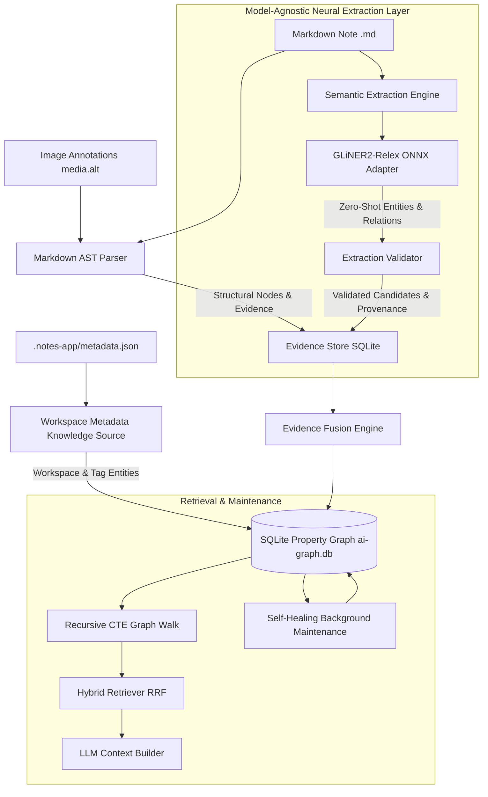
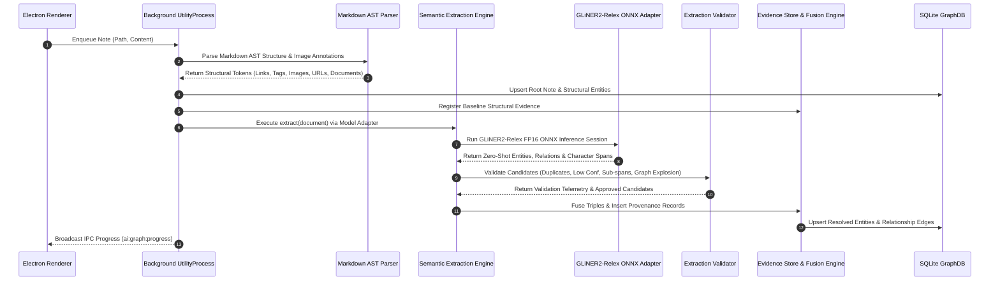
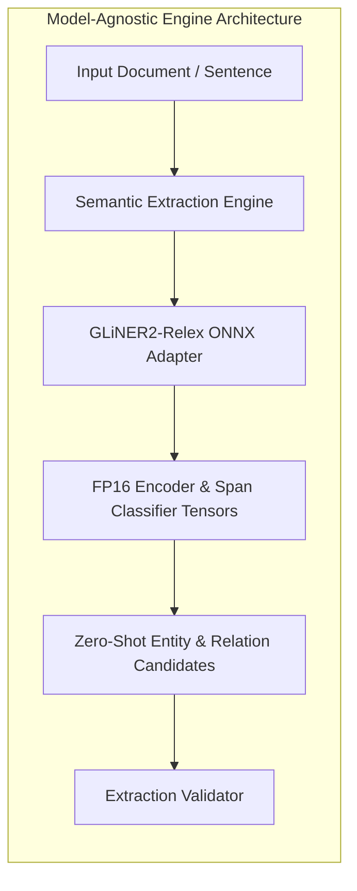
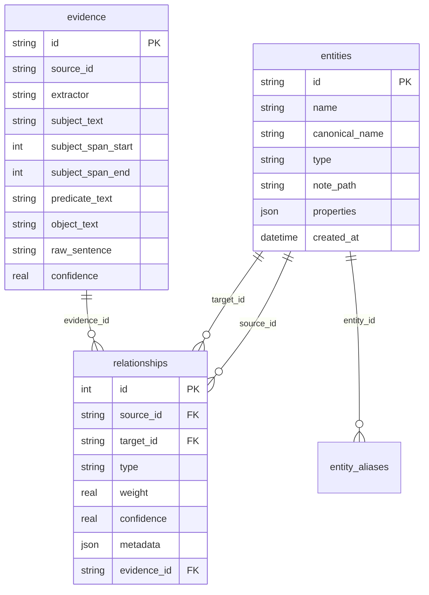
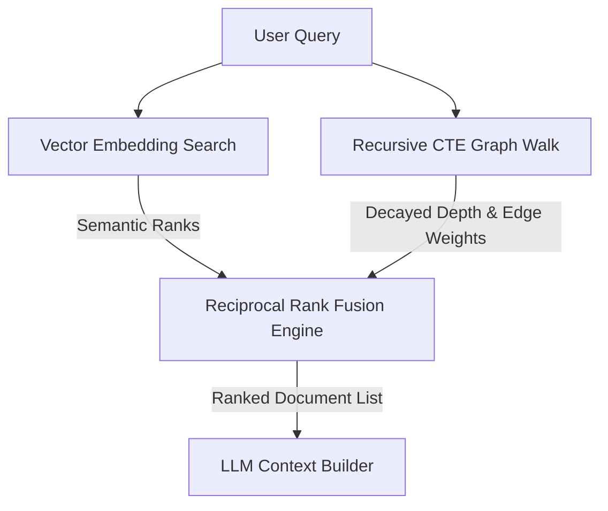

# Knowledge Graph Generation Engine

Notely features an offline, local-first, AI-powered **Knowledge Graph Generation Engine**. It operates without any cloud dependencies, transforming raw Markdown notes, image annotations, and workspace metadata into an interconnected Property Graph using local FP16 ONNX neural models, SQLite storage, and hybrid GraphRAG retrieval.

---

## Architecture Overview

The system uses a multi-tier pipeline separating document structure parsing from model-agnostic neural semantic extraction.

---

## Detailed Pipeline Flow

Processing a Markdown document follows a deterministic, non-blocking pipeline inside an isolated Electron `utilityProcess` worker process.

---

## Key Components & Concepts

### 1. Markdown AST Parser (Structure, Images & Metadata)

The structural parser converts Markdown text, embedded media, and workspace configuration into structural graph elements:

- **Root Note Entity**: Uniquely identifies the document by path hash.
- **Workspace Metadata (`.notes-app/metadata.json`)**: Automatically extracts workspace info, project types, and domain tags (`categorized_by`, `has_project_type`).
- **Image Annotations (``)**: Captures local and remote image links (`contains_media`), extracting semantic captions (`media.alt`) into `Annotation` nodes (`annotated_with`).
- **Frontmatter & Key-Value Metadata**: Automatically extracts YAML block frontmatter and top key-value lines (`Tags:`, `Name:`, `Location:`, `Time:`):
  - `Tags:` / `- tag` $\rightarrow$ Generates `#tag` (`Tag`) nodes linked to Note.
  - `Name: Person A` $\rightarrow$ Generates `Person` entities linked via `has_person`.
  - `Location: City` $\rightarrow$ Generates `Location` entities linked via `located_in`.
- **Wikilinks (`[[Target]]`)**: Links documents to target notes with bidirectional edge weights.
- **Section Headings (`# Heading`)**: Captures document hierarchy (`contains_section`) with level-attenuated weights ($H_1 = 1.4, H_2 = 1.3, \dots, H_6 = 0.9$). Built-in Notely system sections (`# RawNotes`, `# Cleansed`) are excluded.
- **Tags (`#tag`)**: Categorizes concepts (`tagged`).
- **Attachments & External URLs**: Captures external web links (`references_url`) and attached documents (`attaches_file`).
- **Tasks (`- [ ]`, `- [x]`)**: Extracts open (`has_open_task`) and completed (`has_completed_task`) task items.

---

### 2. GLiNER2-Relex ONNX Model Engine

Semantic extraction uses an offline **GLiNER2-Relex FP16 ONNX model** (`dx111ge/gliner2-multi-v1-onnx`) executed via local ONNX runtime (`onnxruntime-node`).

1. **Zero-Shot Named Entity Recognition**:
   Segments document using `Intl.Segmenter` and runs zero-shot GLiNER2 ONNX sessions to extract domain entity candidates (`Application`, `Framework`, `Database`, `Microcontroller`, `Software Component`, `Model`, `Person`, `Concept`) with confidence scores $\ge 0.50$. It avoids hardcoded taxonomies or fixed keyword dictionaries, adapting dynamically to any domain.
2. **Zero-Shot Relation Extraction**:
   Evaluates entity pair candidates within sentence windows, running zero-shot relation classification tensors to score relationship edge connections (`USES`, `STORES`, `GENERATES`, `CREATES`, `COMMUNICATES_WITH`, `CONTROLS`, `DEPENDS_ON`, `IMPLEMENTS`).
3. **Sub-Span Overlap Suppression**:
   Automatically suppresses nested single-word sub-span fragments when larger multi-word entity mentions exist (e.g. suppresses `Home` or `Assistant` if `Home Assistant` is extracted).

---

### 3. SQLite Property Graph & Evidence Store

Knowledge graph data is stored locally in `.notes-app/ai-graph.db` using native SQLite (`node:sqlite`) with Write-Ahead Logging (`PRAGMA journal_mode = WAL;`).

- **Deterministic Entities**: Entity IDs are generated deterministically using SHA-256 (`ent-` + sha256 of type:normalizedName).
- **Evidence & Provenance**: Every AI-discovered relationship links to an `evidence` record preserving exact source offsets, raw sentence text, extractor identity, and confidence score.

---

### 4. Graph Quality Validation & Entity Resolution

- **Pre-Persistence Validation (`ExtractionValidator.js`)**:
  Inspects candidate entities and relationships before saving to DB, filtering out duplicate nodes, duplicate edges, missing evidence, invalid references, low-confidence edges, and enforcing graph explosion limits ($\le 500$ candidates per pass).
- **Canonical Entity Resolution (`EntityResolver.js`)**:
  Resolves entity name variations using hybrid string similarity:
  $$\text{Similarity}(s_1, s_2) = \max\left( \text{LevenshteinSim}(s_1, s_2), \text{JaccardTokenSim}(s_1, s_2) \right)$$
  Candidate matches above threshold $\ge 0.88$ are automatically mapped in `entity_aliases` table.

---

### 5. Hybrid GraphRAG & RRF Retrieval

Retrieval combines semantic vector search with recursive GraphRAG multi-hop walks using **Reciprocal Rank Fusion (RRF)**:

$$\text{RRF\_Score}(d) = \frac{1}{k + \text{Rank}_{\text{vector}}(d)} + \frac{1 + \alpha \cdot W_{\text{graph}}(d)}{k + \text{Rank}_{\text{graph}}(d)}$$

Where:
- $k = 60$ (standard RRF constant)
- $\alpha = 0.25$ (graph weight bonus multiplier)
- $W_{\text{graph}}(d)$ is the accumulated edge weight with depth decay ($1 / (1 + \text{depth})$)

---

### 6. Self-Healing Background Maintenance

When the background job queue drains, `GraphMaintenance` runs incremental cleanup tasks:

1. **Orphan Purging**: Deletes orphan non-note entities with zero connections.
2. **Stale Edge Decay**: Applies decay factor ($W \times 0.95$) to relationships older than 30 days.
3. **Alias Deduplication**: Merges candidate duplicate entity mentions using hybrid string similarity.
