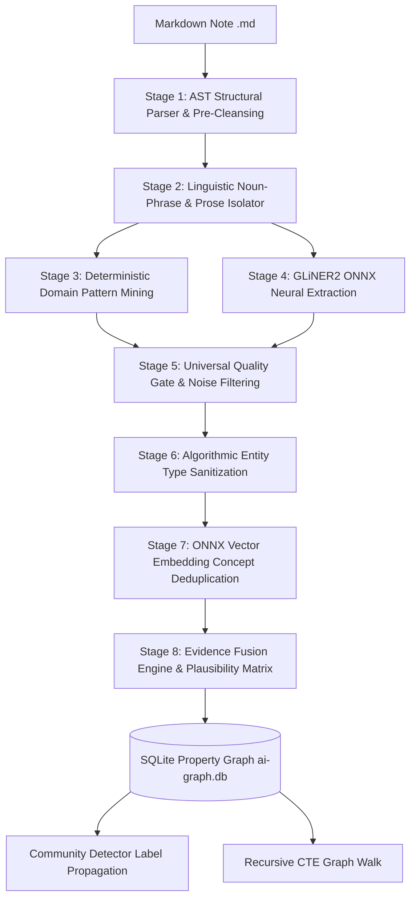
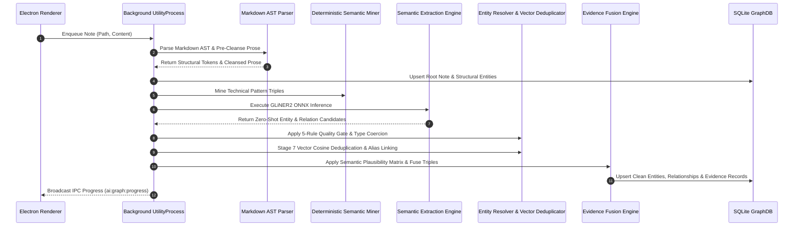
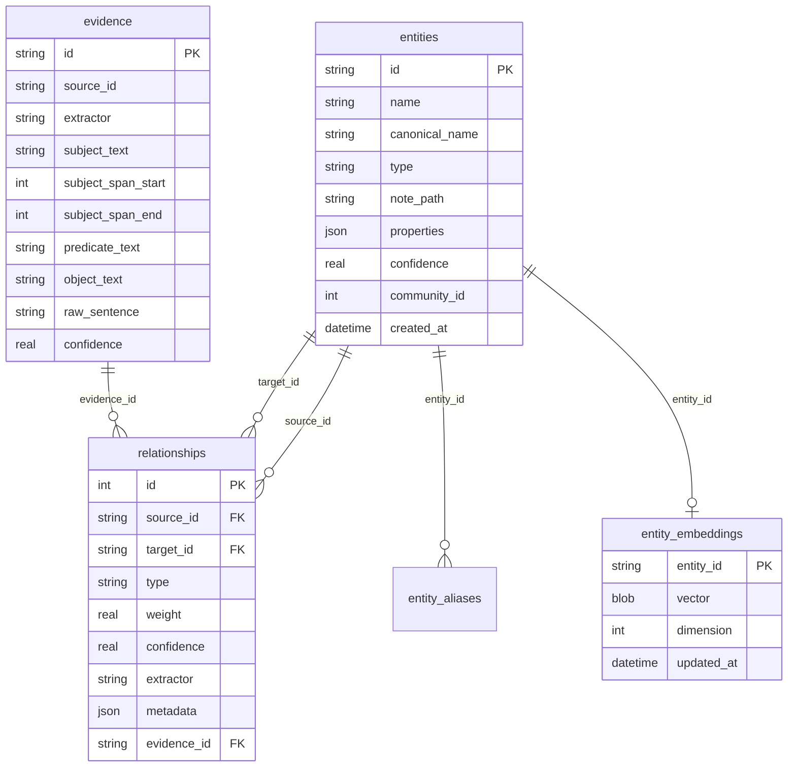

# Knowledge Graph Generation Engine

Notely features an offline, local-first, AI-powered **8-Stage Knowledge Graph Generation Engine**. It operates without any cloud dependencies, transforming raw Markdown notes, image annotations, and workspace metadata into an interconnected Property Graph using local FP16 ONNX neural models, SQLite vector storage, deterministic domain pattern mining, and hybrid GraphRAG retrieval.

---

## Architecture Overview

The system uses an 8-stage pipeline separating document structure parsing from model-agnostic neural semantic extraction, vector embedding deduplication, and evidence fusion.

---

## The 8 Pipeline Stages

### Stage 1: AST Structural Parser & Pre-Cleansing
- **Component:** `MarkdownASTParser.js`
- **Role:** Extracts structural AST entities (`Note`, `Section`, `Tag`, `Media`, `CodeBlock`, `Task`). Strips HTML attributes (`{data-*="..."}`), markdown tables (`| ... |`), image tags, key-value metadata lines, and frontmatter metadata to produce clean natural prose text for neural extraction.

### Stage 2: Linguistic Noun-Phrase & Prose Isolator
- **Component:** `MarkdownASTParser.js` / Sentence Segmenter
- **Role:** Isolates natural language sentences and candidate noun phrases before passing text into heavy ONNX sessions, filtering out structural noise lines and code syntax.

### Stage 3: Deterministic Domain Pattern Mining
- **Component:** `DeterministicSemanticMiner.js`
- **Role:** Mines pattern-based technical domain relationships (`USES`, `DEPENDS_ON`, `GENERATES`, `INTEGRATES_WITH`, `IMPLEMENTS`, `ENABLES`, `WORKS_ON`) directly from prose sentences with $0.88 - 0.92$ baseline confidence.

### Stage 4: GLiNER2 ONNX Neural Zero-Shot Extraction
- **Component:** `GLiNER2RelexAdapter.js`
- **Role:** Runs 5-graph ONNX Runtime inference using `gliner2-multi-v1-onnx`. Extracts neural entities and relationships with calibrated sigmoid scoring (`_sigmoid(val + 1.2)`), capped candidate span width (`maxWidth = 4`), and compound disjunctive entity splitting (`"Gemini or Groq"` $\rightarrow$ `"Gemini"`, `"Groq"`).

### Stage 5: Universal Quality Gate & Noise Filtering
- **Component:** `EntityResolver.js`
- **Role:** Enforces universal length bounds ($2 \le \text{chars} \le 35$, max 4 words), uppercase 2/3-char acronym rules (`AI`, `UI`, `DB`, `API`, `SDK`, `SQL`), grammatical boundary checks, 4+ repeated character entropy, vowel ratio validation, and verb clause rejection (ZERO hardcoded entity word lists).

### Stage 6: Algorithmic Entity Type Sanitization & Coercion
- **Component:** `EntityResolver.js`
- **Role:** Applies Title-Cased proper noun pattern classification (multi-word capitalized names $\rightarrow$ `Person`). Strictly coerces misclassified common nouns (`Workspace`, `AI Integration`, `Screenshot`, `Interactive`) to generic `Concept` or `Technology`.

### Stage 7: ONNX Vector Embedding Concept Deduplication & Alias Fusion
- **Component:** `EmbeddingService.js` + `EntityResolver.js` + `GraphDB.js`
- **Role:** Leverages existing local ONNX embedder (`bge-small-en-v1.5`) to compute 384-dimensional dense vectors stored in SQLite (`entity_embeddings` table). Performs sub-millisecond cosine similarity checks against existing SQLite entity vectors to automatically merge concept variations (`"SQLite DB"` $\leftrightarrow$ `"SQLite Database"`) at $>0.88$ similarity.

### Stage 8: Evidence Fusion Engine, Plausibility Matrix & Community Detection
- **Component:** `EvidenceFusionEngine.js`, `CommunityDetector.js`, `GraphDB.js`
- **Role:** Merges edge confidence scores using probabilistic union $P(A \cup B) = 1 - (1 - P(A))(1 - P(B))$. Enforces the **Semantic Relationship Plausibility Matrix** (blocks structural node domain actions, restricts `COMMUNICATES_WITH`, `IMPLEMENTS`, `GENERATES` predicates to compatible entity types). Executes label propagation community clustering over the cleaned graph.

---

## Detailed Ingestion Flow

Processing a Markdown document follows a deterministic, non-blocking pipeline inside an isolated Electron `utilityProcess` background worker.

---

## Database Schema & Vector Storage

Knowledge graph data is stored locally in `.notes-app/ai-graph.db` using native SQLite (`node:sqlite`) with Write-Ahead Logging (`PRAGMA journal_mode = WAL;`).

---

## Graph Quality & Provenance Validation

- **Universal Quality Gate (`EntityResolver.js`)**:
  Inspects candidate terms before persistence, rejecting stop words, grammatical prepositions, verb fragments, non-word gibberish, and editor syntax artifacts.
- **Semantic Relationship Plausibility Matrix (`EvidenceFusionEngine.js`)**:
  Enforces predicate compatibility rules:
  - Structural nodes (`Note`, `Tag`, `Section`) cannot engage in semantic domain relations.
  - `COMMUNICATES_WITH` requires communicating entity types (`Person`, `Service`, `System`, `Technology`).
  - `IMPLEMENTS` & `GENERATES` require valid technical sources and targets.
- **Evidence Provenance (`EvidenceStore.js`)**:
  Every AI relationship links to an `evidence` record preserving exact source offsets, raw sentence text, extractor identity, and confidence score.

---

## Community Detection & Maintenance

1. **Label Propagation Clustering (`CommunityDetector.js`)**:
   Groups graph nodes into dense semantic communities using fast label propagation clustering.
2. **Self-Healing Background Maintenance (`GraphMaintenance.js`)**:
   - **Orphan Purging**: Deletes unlinked non-note entities.
   - **Stale Edge Decay**: Applies decay factor ($W \times 0.95$) to relationships older than 30 days.
   - **Alias Deduplication**: Merges candidate duplicate entity mentions using vector distance and string similarity.
