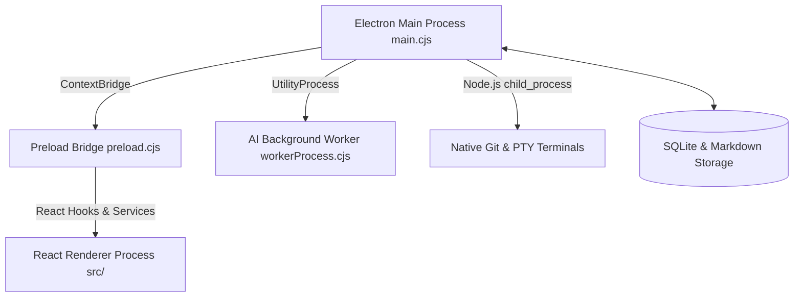

# Developer Documentation

Notely is built with Electron, React, and Vite.

## 1. Core Architecture & Process Model



- **Main Process (`electron/main.cjs`)**: Handles window lifecycle, file I/O, IPC handler registration, menu creation, and system integrations.
- **Background Utility Process (`workerManager.cjs` / `workerProcess.cjs`)**: Spawns an isolated Node.js `UtilityProcess` for asynchronous vector embedding generation and Knowledge Graph indexing. This keeps background indexing CPU spikes off the main thread.
- **Preload Bridge (`electron/preload.cjs`)**: Exposes safe, validated IPC invocation methods to `window.electronAPI`.
- **Renderer Process (`src/`)**: React 18 frontend with Vite, CodeMirror 6 editor canvas, KaTeX rendering, and Lucide icons.

---

## 2. IPC Channel Security Guard Pattern

All `ipcMain.handle` endpoints MUST enforce IPC security guards and payload validation:

1. **Sender Authentication (`assertTrustedIpcSender`)**: Enforces that IPC invocation events originate strictly from verified internal application renderer windows, rejecting unauthorized external or injected frame messages:
   ```javascript
   const { assertTrustedIpcSender } = require("./ipcSecurity.cjs");
   ipcMain.handle("myChannel", async (event, rawPayload) => {
     assertTrustedIpcSender(BrowserWindow, event, "myChannel");
     // ...
   });
   ```
2. **Payload Schema Validation (`ipcSchemas.cjs`)**: Validate raw payloads against strict schema contracts (`validatePayload`) to ensure type safety before processing file paths or commands.

---

## 3. Development Workflow & Commands

### Development Server
```bash
npm run dev
```
Launches Vite HMR server and Electron wrapper simultaneously.

### Build Production Bundle
```bash
npm run build
```
Compiles Vite frontend assets and validates CommonJS Electron main scripts.

### Documentation Site
```bash
npm run docs:dev     # Launch VitePress live preview server
npm run docs:build   # Build static production docs site
```

---

## 4. Test Suite Execution

Notely uses **Vitest** for comprehensive unit, integration, and IPC service testing:

```bash
# Run all unit and integration tests
npm test

# Run tests in watch mode
npm run test:watch

# Run P2P network integration test harness
npm run test:p2p
```

### Key Test Directories
- `tests/ai/`: Core AI orchestration, 5-stage `AIFlow`, 4-layer planning, compaction, and facade integrity tests.
- `tests/golden_workspace.test.js`: Workspace creation, note CRUD, task database sync, and file watcher tests.
- `electron/lib/ipc/codeExecutorIpc.test.js`: Code execution runner tests.
- `electron/p2p/p2pLive.test.js`: Peer-to-peer discovery and encrypted handshake tests.

---

## 5. Build & Packaging Scripts

For generating standalone distribution packages:

- **Windows Executable Build Script (`build-windows-exe.sh`)**: Compiles and bundles a standalone Windows executable.
- **Release Packaging Script (`release.sh`)**: Automates version stamping, package archive creation, and release checksum generation.
- **Icon Generation (`scripts/generate-icon.cjs`)**: Generates app icons from source image assets (`process.env.NOTELY_ICON_SOURCE`).

