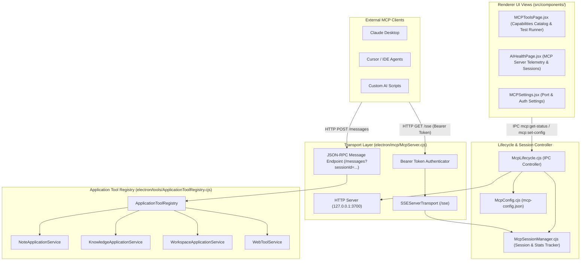

# Notely Model Context Protocol (MCP) Architecture

Notely features a first-class, local-first **Model Context Protocol (MCP)** server embedded directly into the Electron main process. This allows external AI clients (such as Claude Desktop, Cursor, IDE AI agents, or custom scripts) to connect to Notely via SSE (Server-Sent Events) and discover, read, search, and edit workspace notes using Notely's application capabilities.

---

## 1. Subsystem Components Architecture

---

## 2. Server & Transport Specifications

* **Protocol Version**: Model Context Protocol JSON-RPC 2.0.
* **Default Endpoint**: `http://127.0.0.1:3700/sse`
* **Message Endpoint**: `http://127.0.0.1:3700/messages?sessionId=<session_id>`
* **Health Check**: `GET /health` or `GET /status` returns JSON server state, version (`0.1.41`), and registered tool count.
* **Authentication**: Optional HTTP Authorization Header `Bearer <token>`.
* **Session Lifecycle**: Connections managed via `SSEServerTransport`. Disconnections gracefully purge active session state from `McpSessionManager`.

---

## 3. Registered Tool Capabilities

External clients can call `tools/list` to inspect Notely's available tool schema. Tools are provided via `ApplicationToolRegistry.cjs`:

| Tool Name | Service Domain | Description |
| :--- | :--- | :--- |
| `note.create` | Note Service | Create a new Markdown document with initial content and title. |
| `note.read` | Note Service | Read document content and metadata by relative path. |
| `note.update` | Note Service | Edit or append to existing Markdown document. |
| `note.delete` | Note Service | Delete note file in workspace. |
| `workspace.search` | Workspace Service | Perform full-text search across all workspace Markdown files. |
| `workspace.list_files` | Workspace Service | Recursively list workspace files and folder structure. |
| `graph.query` | Knowledge Service | Query knowledge graph nodes, wikilinks, and cross-references. |
| `graph.get_stats` | Knowledge Service | Get node, link, and graph density statistics. |
| `tasks.list` | Workspace Service | Parse GFM task lists (`- [ ]`) across notes. |
| `system.get_info` | App Service | Get workspace path, version info, and server health metrics. |

---

## 4. UI Capabilities Catalog & Diagnostics

Notely provides two specialized React UI views for managing and inspecting the MCP subsystem:

1. **MCP Tools & Capabilities (`src/components/MCPToolsPage.jsx`)**:
   - **Live Status Header**: Real-time status badge (Running / Stopped / Port Conflict), active session counter, and total invocation counter.
   - **Category Filters**: Categorized by *All*, *Notes & Docs*, *Search & Graph*, *Workspace & Files*, and *System & AI*.
   - **Parameters Schema Inspector**: Type-coded parameter tags (`string`, `number`, `boolean`, `object`, `array`) and `REQUIRED` badges.
   - **Interactive Console Test Runner**: Dark syntax-highlighted IDE console (`#0f172a`), 1-click **Auto-Fill JSON** sample generator, and **Copy Output** button.
   - **Manifest Exporter**: 1-click **Export Manifest** button to copy full JSON-RPC tool schema manifest to clipboard for external integration.

2. **MCP Diagnostics & Health (`src/components/AIHealthPage.jsx`)**:
   - Live telemetry feed for active SSE sessions, remote client User-Agents, request durations, and error diagnostics.

---

## 5. Security & IPC Control

All IPC handlers (`mcp:get-status`, `mcp:set-config`, `mcp:start`, `mcp:stop`, `mcp:restart`, `mcp:get-sessions`) enforce trusted sender verification via `assertTrustedIpcSender`.
