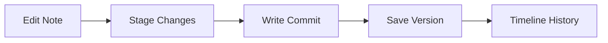

# Git Version Control

Notely features a native, Git-backed version control system to track document changes. Every modification can be versioned, compared, and restored without relying on external Git tools.

## Why Git?

Using Git directly under the hood ensures:
- **Portability**: Your note history is stored in standard Git format, meaning you can open the folder in any Git client (like GitHub Desktop or VS Code) to view the history.
- **Precision**: Fine-grained line-by-line diffs of changes.
- **Safety**: Rollback individual files or entire folders to a previous point in time.

---

## Attached Code Repositories

Beyond version controlling your markdown workspace notes, Notely allows you to attach external local **Git repositories** to link software architecture directly with documentation:
- **Zero Copying**: Keeps external source code in place on disk.
- **AST Parsing**: Automatic code symbol extraction (classes, methods, functions, endpoints, database models) across 8+ languages using Tree-sitter.
- **Knowledge Graph Integration**: Explorable code entity nodes in the [Knowledge Graph](/ai/knowledge-graph).
- **Referenced Notes**: Mention attached repositories with `[[RepoName]]` or `@RepoName` in any note.

See full guide: [Attached Code Repositories](/workspace/attached-repos).
